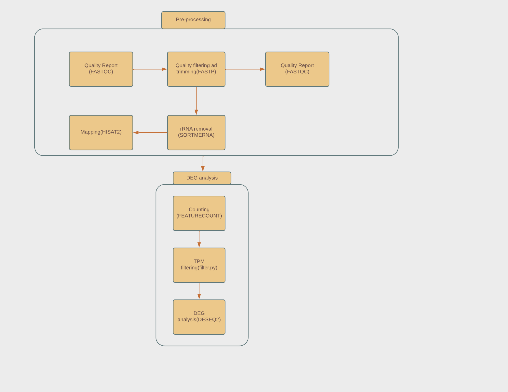

# Differential Gene Expression Analysis of Common Bean Lineages During Development

Common bean(Phaseolus vulgaris) is an annual leguminous plant grown majorly for its edible dry seeds. It is a protein-rich legume with vital proteinaceous nutrients, carbohydrates, some vitamins and micronutrients. Despite its nutritional importance, its adoption in diets is restricted by a phenomenon known as the hard-to-cook defect. Transcriptomic profiling in three common bean varieties, fast-cooking (cv. Rosecoco), a slow-cooking (cv. Pinto) and intermediate (cv. Canadian wonder) is explored in this study to determine differentially expressed genes that may contribute to HTC development.

## **Aim and Objectives**

The aim is to identify differentially expressed genes useful in the development of hard-to-cook defect. 

## **Workflow**

## **Data Sources**

Differential gene expression analysis will be carried out using pubicly available RNA seq data of the three comon bean varieties from [NCBI-SRA](https://github.com/omicscodeathon/commonbean_degs/blob/main/accessions/acc_list52.txt)

## **Contributors**

1. Olaitan Awe

2. Brenda Kiage
